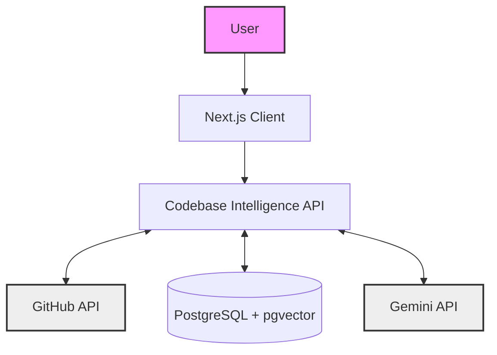
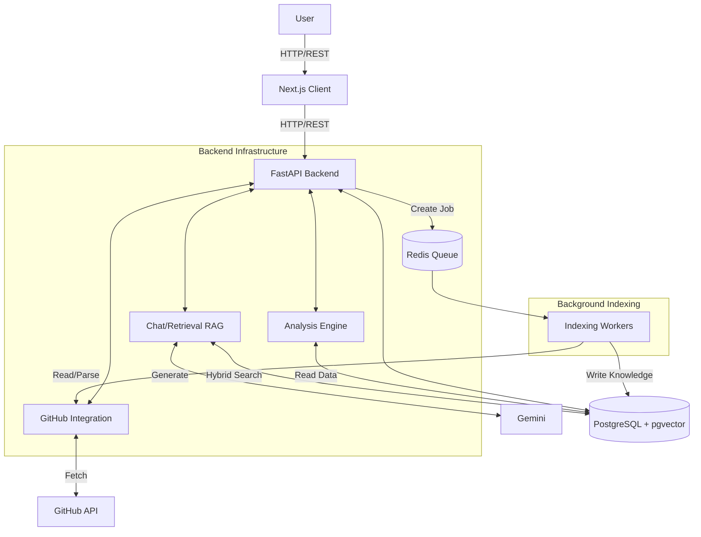
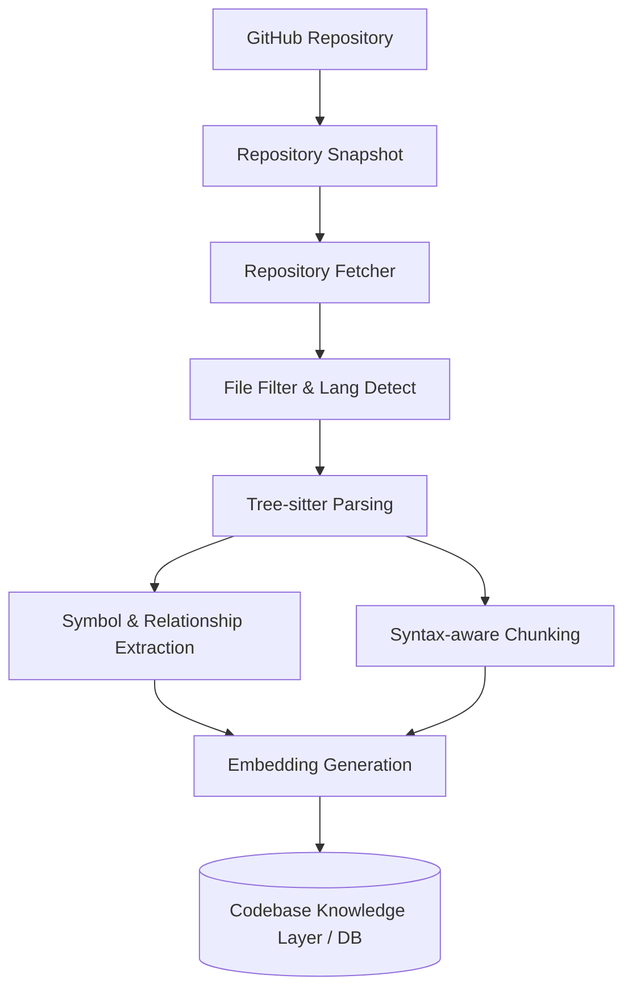
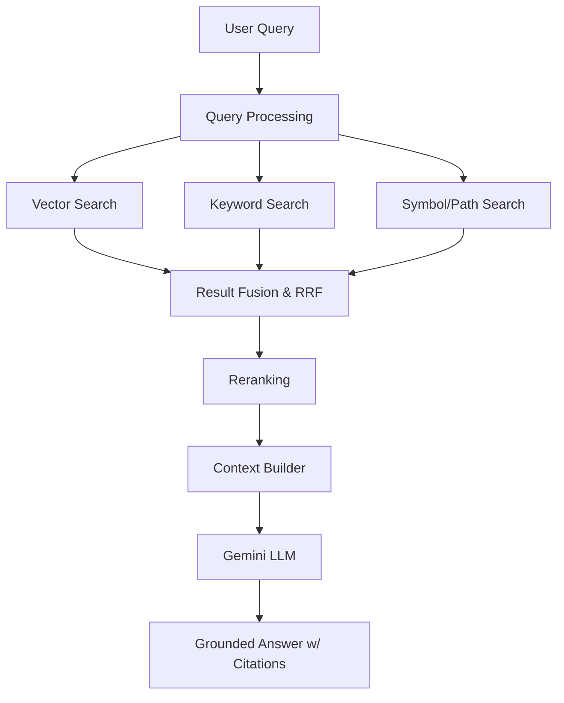
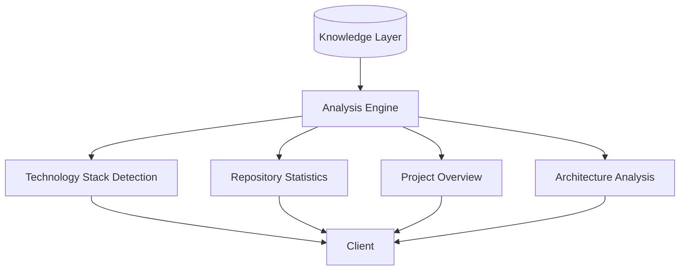
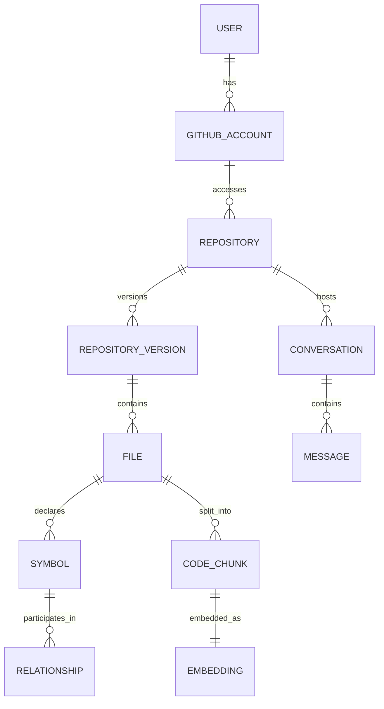

# Codebase Intelligence - Architecture Design

This document outlines the final architecture for the Codebase Intelligence platform, defining components, boundaries, data models, and operational flows.

## 1. Revised Architecture Summary

Codebase Intelligence is an AI-powered GitHub repository analysis platform designed for codebase understanding, architecture mapping, code search, and grounded Q&A. The architecture strictly separates the **Client Layer**, **Application API**, and **Analysis/Indexing Layer**.

The platform is designed around the concept of a **Repository Snapshot (Version)**. When a repository is analyzed, the system captures its state at a specific commit. All derived insights, symbols, chunks, and embeddings are tied to this version, forming a **Codebase Knowledge Layer** backed by PostgreSQL and `pgvector`. This ensures that all AI answers and visual architectures are deterministically grounded in specific source code.

Complex tasks like Tree-sitter parsing and embeddings generation are handled by **Background Workers** via a Redis job queue, keeping the API responsive. Retrieval is powered by a **Hybrid Search** strategy, combining exact matches with semantic similarity. The AI (Gemini) is used strictly for reasoning and generation over the retrieved context, while facts like the technology stack are extracted via deterministic analysis.

---

## 2. Architecture Components & Responsibilities

1. **Next.js Client**: The user interface. Handles user authentication state, repository selection, analysis visualization (architecture graph, stats), codebase chat, and code viewing.
2. **FastAPI Application API**: The primary backend service. Serves API endpoints, handles business logic, and orchestrates interactions between the frontend, database, and background workers.
3. **GitHub Integration Layer**: Manages the GitHub App OAuth flow, fetches user repositories, and retrieves raw repository contents. Enforces the principle of least privilege.
4. **Analysis/Indexing Layer (Background Workers)**: Asynchronous workers managed via Redis. Responsible for fetching source code, running Tree-sitter parsing, extracting symbols/relationships, chunking code, generating embeddings, and saving to the Knowledge Layer.
5. **Codebase Knowledge Layer (PostgreSQL + pgvector)**: The central source of truth for all repository data. Stores versions, files, chunks, symbols, graph relationships (via foreign keys/join tables), and vector embeddings.
6. **Retrieval / RAG Layer**: Processes user queries, executes Hybrid Search (keyword + vector + symbol), fuses results (e.g., Reciprocal Rank Fusion), and constructs the final context for the AI.
7. **Analysis Engine**: Operates on the Knowledge Layer to deterministically extract facts. Responsible for identifying the technology stack, project overview, and architecture graph based on hard evidence (e.g., manifest files, imports).
8. **AI Generation Layer (Gemini)**: Provides AI reasoning over the context built by the Retrieval Layer. Responsible for answering questions and generating summaries based *only* on provided context.
9. **Infrastructure Layer**: Docker and Docker Compose orchestrating the FastAPI server, PostgreSQL, Redis, and Worker containers.

---

## 3. Architecture Views

### View 1: System Context

### View 2: Container / High-Level Architecture

### View 3: Indexing Pipeline (Asynchronous)

### View 4: RAG Pipeline (Synchronous)

### View 5: Analysis Engine

### View 6: Data / Knowledge Model

---

## 4. Operational Flows

### Synchronous Flows (Immediate API Response)
- User Authentication (GitHub OAuth callback exchange).
- Reading existing repository knowledge (listing files, viewing chunks).
- Retrieving Analysis results (Tech stack, Stats, Architecture graph).
- AI Codebase Chat (Query -> Hybrid Search -> RAG -> Gemini Response).

### Asynchronous Flows (Background Processing)
- **Repository Indexing**: User requests analysis -> API creates job -> Redis -> Worker executes pipeline (fetch, parse, embed, save) -> API polls or receives updates.
- **Repository Re-indexing**: Updating knowledge to a newer commit follows the exact same asynchronous path, creating a new `RepositoryVersion`.

---

## 5. Security & Isolation Boundaries

- **GitHub Credentials**: GitHub App credentials (Client Secret, Private Key, Installation Tokens) never leave the backend. The frontend only receives JWT/Session tokens identifying the application user.
- **Untrusted Code**: Repository source code is treated as untrusted data. AI system instructions are strictly separated from retrieved repository context to mitigate prompt injection risks.
- **API Access**: All API endpoints accessing repository data enforce authorization checks against the user's linked GitHub account and app installation permissions.

---

## 6. Repository Versioning & Provenance Strategy

The architecture enforces a strict **Repository Version (Snapshot)** model. All extracted files, symbols, chunks, and relationships are tied to a specific Commit SHA and timestamp (`RepositoryVersion`). 

**Provenance Strategy**:
Every piece of knowledge in the database includes source provenance: `repository_id`, `version_id`, `file_path`, `start_line`, and `end_line`.
During the RAG process, the Context Builder includes this provenance alongside the code chunks. The AI is instructed to cite its sources using this metadata. The frontend translates these citations into interactive links to the in-app Code Viewer, highlighting the exact lines used.

---

## 7. MVP vs. Future Boundaries

### MVP
- **Auth**: GitHub App authentication.
- **Ingestion**: Asynchronous indexing of a specific repository commit.
- **Parsing**: Tree-sitter AST, symbol, and relationship extraction.
- **Data**: Postgres + pgvector + Redis.
- **Search**: Hybrid search (Keyword + Vector) with Reciprocal Rank Fusion.
- **Features**: Deterministic tech stack/architecture, AI chat with RAG and citations, code viewer.

### Future
- Incremental re-indexing on GitHub Push Webhooks.
- Autonomous coding agents and automated PR generation.
- Multi-repository context reasoning.
- Dedicated graph database (Neo4j) if relational graph queries bottleneck.
- Advanced reranking models (e.g., Cohere).

---

## 8. Architectural Decisions (ADRs)

The following Architectural Decision Records have been created in `docs/adr/`:

- [ADR-001: PostgreSQL + pgvector as Primary Data Store](adr/001-postgresql-pgvector.md)
- [ADR-002: GitHub App Authentication](adr/002-github-app-authentication.md)
- [ADR-003: Repository Versioning and Snapshot Model](adr/003-repository-versioning.md)
- [ADR-004: Tree-sitter for Source Parsing](adr/004-tree-sitter-parsing.md)
- [ADR-005: Redis and Background Workers for Indexing](adr/005-redis-background-workers.md)
- [ADR-006: Hybrid Retrieval](adr/006-hybrid-retrieval.md)
- [ADR-007: Repository Knowledge Graph via PostgreSQL Relationships](adr/007-repository-knowledge-graph.md)
- [ADR-008: Separation of Deterministic Analysis from AI Analysis](adr/008-deterministic-vs-ai-analysis.md)
- [ADR-009: Repository Provenance and Citations](adr/009-provenance-citations.md)
- [ADR-010: MVP Scope](adr/010-mvp-scope.md)

---

**Note:** This concludes the Architecture Revision and Design phase. The next phase will be Database/ERD Design and Alembic Schema implementation. Do not begin implementation without reviewing and locking these architectural decisions.
