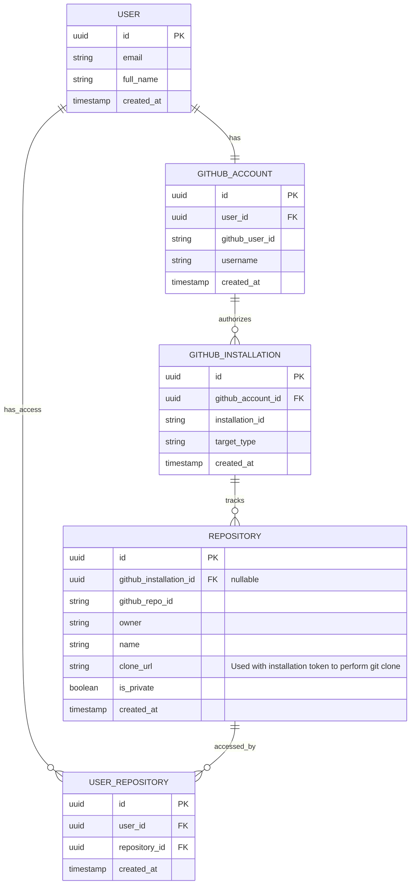
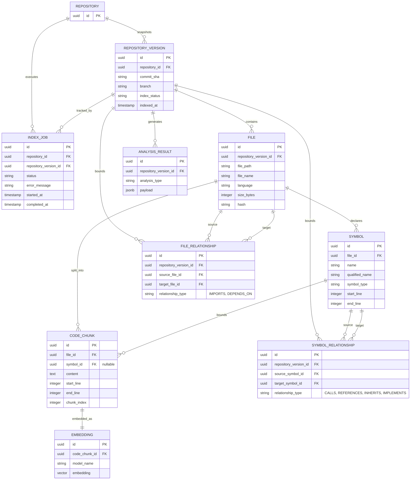
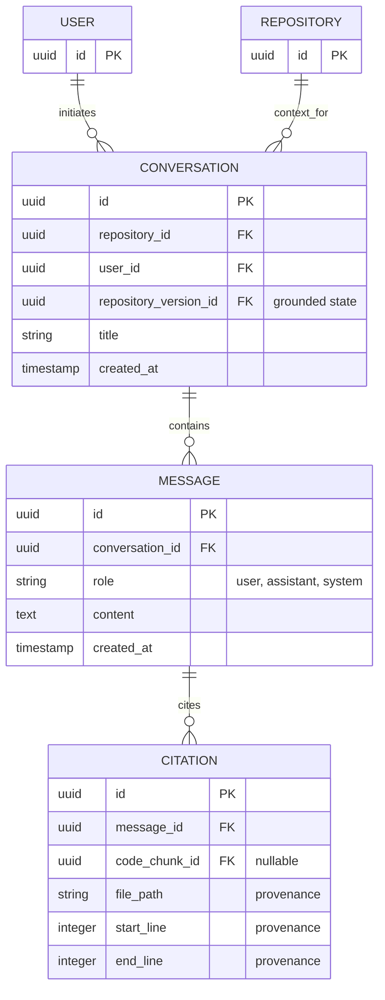

# Database Entity-Relationship Diagram (ERD)

This diagram visualizes the Codebase Intelligence database schema. It is separated into logical domains to maintain readability.

## 1. Core Data & Authentication ERD

## 2. Code Intelligence & Indexing ERD

## 3. Chat & Citations ERD

