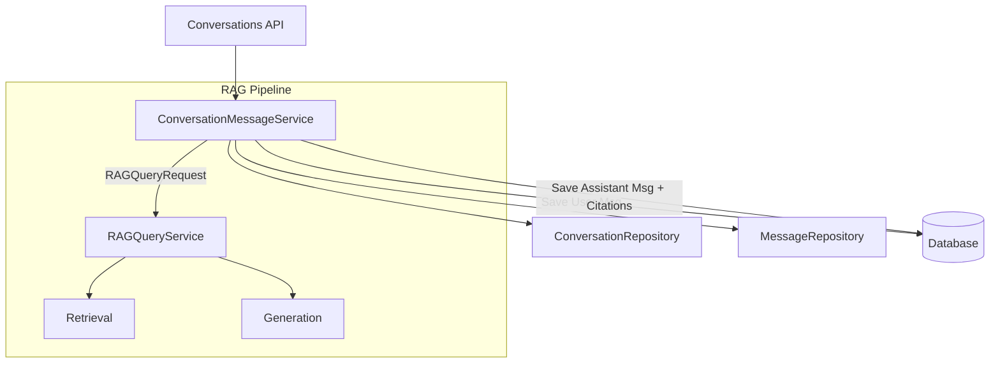
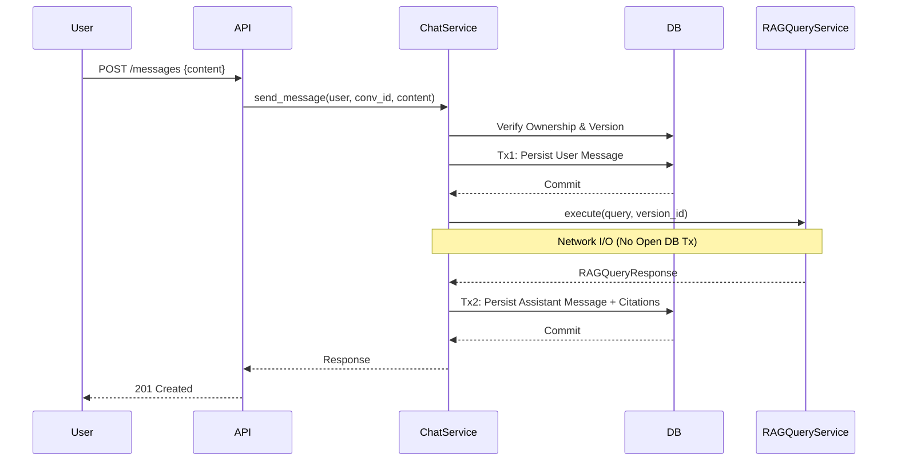

# Phase 5.2 — Conversation Message / RAG Integration

## 1. Current Architecture
Currently, the repository is split into two robust but completely disconnected domains:
- **Conversation Domain:** Manages `Conversation`, `Message`, and `Citation` persistence. Conversations are bound to a specific `repository_version_id` at creation. `ConversationService` handles CRUD but lacks message creation logic.
- **RAG Domain:** `RAGQueryService` handles stateless execution of Retrieval → Context Assembly → Generation → Citation → Final Answer. It operates on a `RAGQueryRequest` and returns a `RAGQueryResponse`. It does not know about conversations or database persistence.

## 2. Existing Contracts
* **RAGQueryService:** Accepts `(repository_id, query, repository_version_id, limits)` and returns `(answer, citations, version_id)`. Strictly stateless.
* **ConversationService:** Accepts `(user_id, conversation_id, repository_id)` for lifecycle management.
* **Conversation Model:** Hard-links to a specific `repository_version_id`.
* **Citation Model:** Hard-links to `message_id` and optionally `code_chunk_id`.

## 3. Recommended Architecture
We must bridge the domains without violating their boundaries. The recommended architecture introduces a dedicated orchestrator: `ConversationMessageService` (or `ChatService`).



## 4. Conversation History Strategy
**Recommendation: Option C (Separate query rewriting layer) is the correct architectural end-state, but Option A (Stateless RAG query) should be implemented first for Phase 5.2.**

* **Option A (Stateless):** Passes the latest user message directly to `RAGQueryService`. Easy to implement, preserves exact semantic search quality, but loses conversational context (e.g., "what about that function?").
* **Option B (History-aware RAG via concatenation):** Appending history into the `RAGQueryRequest.query` field will heavily degrade vector embeddings in the `RetrievalService`. This is an anti-pattern for semantic search.
* **Option C (Query Rewrite):** Passes conversation history to a new LLM call that rewrites the user's latest message into a standalone query, which is then fed to `RAGQueryService`. This preserves semantic search accuracy and allows follow-up questions.

**Decision:** For Phase 5.2, we should strictly connect the existing stateless `RAGQueryService` to the message lifecycle (Option A) to prove the transaction boundaries and citation persistence. Once this pipe is solid, Phase 5.3 should introduce the `QueryRewriteService` (Option C) before the RAG call.

## 5. Message Lifecycle
The lifecycle must protect data integrity against LLM network failures.



## 6. Transaction Strategy
**Crucial Rule:** Never hold a database transaction open while waiting for the LLM.
- **Transaction 1:** Create and commit the User's `Message` immediately. If RAG fails, the user's message is still persisted (allowing for future retry mechanisms or UI visibility of the failure).
- **Execution:** Call `RAGQueryService` (asynchronous, no open DB session).
- **Transaction 2:** Create the Assistant's `Message`, map the returned citations to `Citation` models, and commit them together.

## 7. Repository Version Strategy
**Policy: Absolute Version Pinning.**
A conversation is permanently locked to the `repository_version_id` it was created with. 
* Every RAG query inside that conversation MUST explicitly pass that `repository_version_id` to `RAGQueryService`.
* This guarantees that citations refer to the exact code chunks that existed when the conversation started, preventing hallucinated file paths if a background re-indexing occurs.

## 8. Citation Persistence Strategy
Citations returned by `RAGQueryService` (which contain `file_path`, `start_line`, `end_line`, and optionally `code_chunk_id`) must be persisted directly into the `citations` table, linked to the newly created Assistant `message_id`. 
* Duplicate citations in the same message are acceptable if the LLM generated them, as they represent exactly what the LLM cited. 
* The API should return the citations nested within the Assistant message schema.

## 9. Service Boundary
**Recommendation: Create a new `ConversationMessageService`.**
Do not bloat `ConversationService` (which focuses on CRUD/ownership of the Conversation metadata) or `RAGQueryService` (which focuses on stateless intelligence). The new `ConversationMessageService` acts as the domain use-case orchestrator.

## 10. API Contract
**Endpoint:** `POST /api/v1/conversations/{conversation_id}/messages`

**Request:**
```json
{
  "content": "How does the auth module work?"
}
```

**Response (Option C / Structured):**
Returning a structured generation result is safest to provide the client with everything that happened.
```json
{
  "user_message": {
    "id": "uuid",
    "role": "user",
    "content": "..."
  },
  "assistant_message": {
    "id": "uuid",
    "role": "assistant",
    "content": "...",
    "citations": [
      {
        "id": "uuid",
        "file_path": "main.py",
        "start_line": 10,
        "end_line": 20
      }
    ]
  }
}
```

## 11. Error Contract
* `ConversationNotFoundError` / Unauthorized User -> `404 Not Found`
* Empty message validation -> `400 Bad Request` (via Pydantic)
* `NoIndexedVersionError` (if the pinned version was deleted) -> `400 Bad Request`
* `TransientLLMError` -> `502 Bad Gateway` (User message remains in DB)
* `PermanentLLMError` -> `502 Bad Gateway` (User message remains in DB)

## 12. Idempotency Strategy
**Recommendation: Defer implementation.**
While UI retries on a `502 Bad Gateway` will result in duplicate user messages, implementing idempotency keys (`Idempotency-Key` headers + Redis caching) is out-of-scope for the immediate RAG integration. The UI can temporarily handle this by disabling the send button until a response or timeout occurs.

## 13. Security Analysis
* **Cross-User Isolation:** `ConversationMessageService` MUST first call `conversation_repo.get_for_user(conversation_id, user_id)`. If this fails, the process halts.
* **Prompt Injection:** A user could attempt to inject commands. `RAGQueryService` is already protected by strict system prompts.
* **IDOR:** The strict `user_id` validation protects against modifying or appending to other users' conversations.

## 14. Test Strategy
* **Unit Tests:** Mock `RAGQueryService` and `MessageRepository`. Verify `ConversationMessageService` throws `404` for bad ownership. Verify transaction ordering (user message saved before RAG call).
* **Integration Tests:** Use real PostgreSQL to verify that creating a message correctly cascades and saves associated `Citation` records with the correct foreign keys.
* **API Tests:** Use Pytest with the FastAPI TestClient to test the `POST` endpoint, verifying validation and error mapping.
* **Postman:** Add a new request to the `collection_v2.json` to perform end-to-end message generation against the live application.

## 15. Exact Files To Create
* `server/app/schemas/message.py` (New schemas for Request/Response contracts)
* `server/app/services/conversation/message_service.py` (The new `ConversationMessageService`)
* `server/tests/services/conversation/test_message_service.py`
* `server/tests/api/v1/test_conversation_messages.py`

## 16. Exact Files To Modify
* `server/app/api/v1/endpoints/conversations.py` (Add the POST messages route)
* `server/app/repositories/message.py` (Ensure citation saving logic is sound)

## 17. Scope Boundaries
**IN SCOPE:** Saving user message, calling RAG, saving assistant message + citations, returning structured response.
**OUT OF SCOPE:** Query rewriting (deferred to Phase 5.3), streaming (Server-Sent Events), WebSockets, Idempotency-Keys, background agents.

## 18. Risks and Tradeoffs
* **Risk:** The RAG call takes 5-15 seconds. Standard HTTP clients might time out. 
* **Tradeoff:** By not using streaming or async background tasks, we block the HTTP thread. This is acceptable for Phase 5.2 (MVP synchronous API) but will necessitate WebSockets or SSE in the future.
* **Risk:** RAG generates successfully, but saving the assistant message fails (DB error). The LLM compute is wasted, and the user's message is left hanging without a reply.

## 19. Definition of Done
* `POST /api/v1/conversations/{id}/messages` is fully functional.
* Real database transactions persist User Message, Assistant Message, and Citations.
* LLM generated citations correctly map to PostgreSQL `citations` table.
* The API returns the completed structured payload.
* All unit and integration tests pass.
* Postman verification succeeds on a live environment.

## 20. Recommended Implementation Order
1. Define Pydantic schemas in `message.py`.
2. Implement `ConversationMessageService` with strictly separated DB transactions.
3. Write unit tests for the service.
4. Implement the FastAPI route in `endpoints/conversations.py`.
5. Write API integration tests.
6. Execute live Postman verification.
